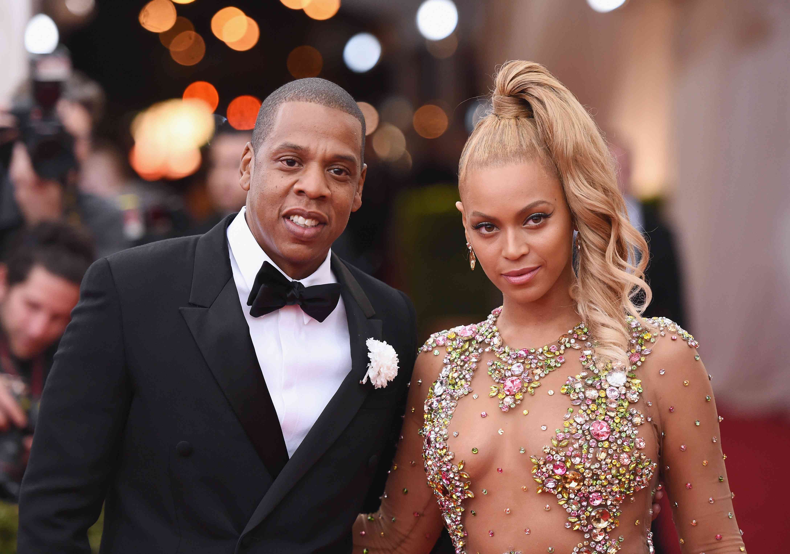

# Remove-Photo-Background-using-TensorFlow
In this program, we are using image segmentation to remove background from photos. For this, we are using a DeepLabV3+ trained on the human image segmentation dataset.

## DeepLabV3+
- Complete Code: [Human Image Segmentation with DeepLabV3+ in TensorFlow](https://github.com/nikhilroxtomar/Human-Image-Segmentation-with-DeepLabV3Plus-in-TensorFlow)
- Dataset:  [Person Segmentation](https://www.kaggle.com/nikhilroxtomar/person-segmentation/download)
- Weight file: [model.h5](https://drive.google.com/file/d/17QKxSIBFhyJoDps93-sCVHnVV6UWS1sG/view?usp=sharing)

## Results
Here are some of the images, where the background is removed and changed to red.
Original Image             |  Processed Image 
:-------------------------:|:-------------------------:
  |  
  |  
## Contact
For any query contact below:
- [Facebook](https://www.facebook.com/idiotdeveloper)
- [Instagram](https://www.instagram.com/nikhilroxtomar/)
- [Telegram](https://t.me/idiotdeveloper)
